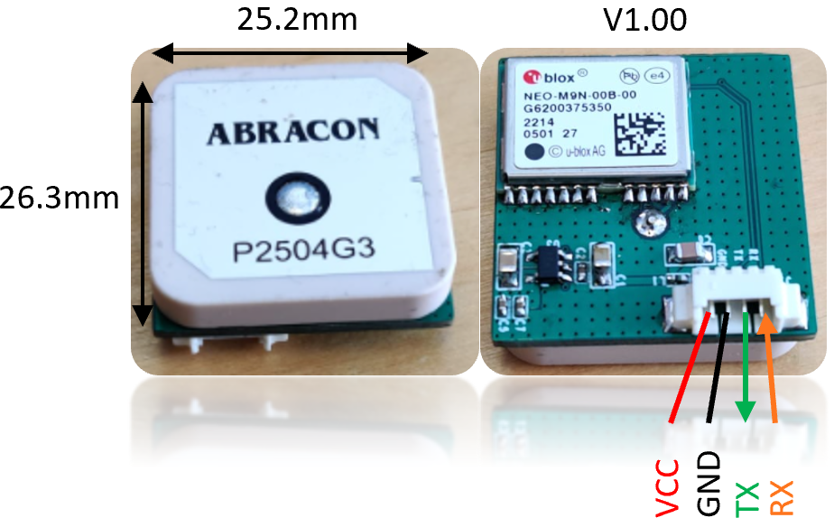
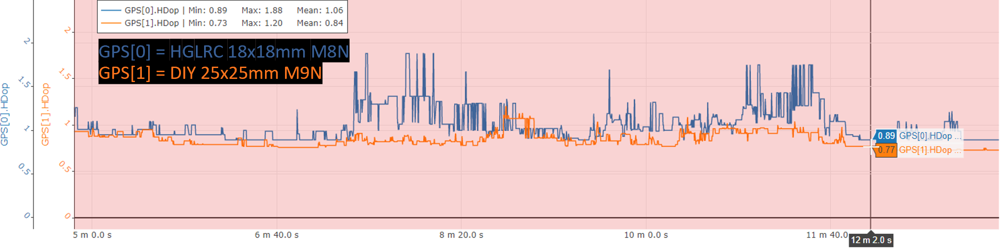

# DIY - Ublox NEO-M9N GPS module

# Introduction
After too many bad experience with cheap clone GPS's, I wanted a reliable GPS unit which used the M9N Ublox chip and had a build in filter for removing noise on the input power (+5V). I was not able to find this so I decided to design one myself.

# Features:
- Uses [M9N Ublox GPS module](https://content.u-blox.com/sites/default/files/NEO-M9N-00B_DataSheet_UBX-19014285.pdf).
- Build in LDO, input voltage (3.3V-5V).
- Build in EMI Low Pass Filter on power supply input (~40dB att. @ GPS frequency’s).
- Form factor of 25x25x8mm ~20gram.
- Price: ~$30-$40USD, when building 10pcs.

# Performance test:
## Ground test of NEO-M9N 25x25mm vs HGLRC NEO-M8N 18x18mm (using car):
Each GPS was mounted in each wing of my AR-Wing Pro and connected to the FC.

The Wing was placed on the dashboard of my car while a drove around. The results are:\
\

### Conclusion (Ground test)
The M9N with the bigger antenna and power filter out performs the M8N.
 
# Revision
Version V1.00 - First Release.\
